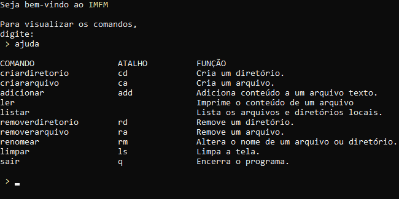

# 📂 IMFM

   
  
   

<b>IMFM</b> — mini-gerenciador de arquivos por terminal.

## Sobre

Este programa foi desenvolvido pelos alunos Iago Pinheiro e Milton Gabriel, do primeiro semestre de Engenharia de Computação da Universidade Federal do Ceará, Campus Sobral, como trabalho final da disciplina de Programação Computacional - 2025.1.

## Funcionalidades

O mini-gerenciador IMFM funciona por meio de comandos enviados pelo usuário, que são interpretados por um algoritmo interno de comparação. A tabela a seguir apresenta os comandos disponíveis, seus atalhos, argumentos esperados, tipos e respectivas funcionalidades:

| COMANDO          | ATALHO | ARGUMENTO                  | TIPO              | FUNÇÃO                                           |
|------------------|--------|----------------------------|-------------------|--------------------------------------------------|
| `ler`            | —      | nome do arquivo            | Arquivo           | Imprime o conteúdo de um arquivo                |
| `criararquivo`   | `ca`   | nome do arquivo            | Arquivo           | Cria um novo arquivo                            |
| `criardiretorio` | `cd`   | nome do diretório          | Diretório         | Cria um novo diretório                          |
| `removerarquivo` | `ra`   | nome do arquivo            | Arquivo           | Remove um arquivo existente                     |
| `removerdiretorio`| `rd`  | nome do diretório          | Diretório         | Remove um diretório existente                   |
| `renomear`       | `rm`   | nome atual, novo nome      | Arquivo/Diretório | Renomeia um arquivo ou diretório                |
| `adicionar`      | `add`  | nome do arquivo            | Arquivo           | Adiciona conteúdo a um arquivo texto            |
| `listar`         | —      | —                          | —                 | Lista os arquivos e diretórios no diretório atual |
| `limpar`         | `ls`   | —                          | —                 | Limpa a tela do terminal                        |
| `sair`           | `q`    | —                          | —                 | Encerra o programa                              |

## Relacionado

- [unit-converter-pvx](https://github.com/vander-furtuna/unit-converter-pvx) – conversor de unidades

## Licença

[MIT](LICENSE)
